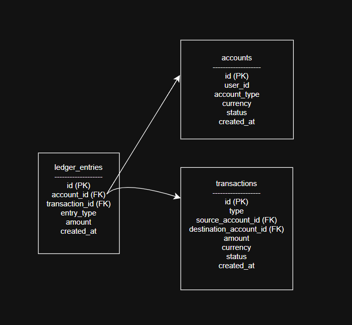

# Financial Ledger API

This project is a backend service that implements a financial ledger system using
double-entry bookkeeping principles. It ensures strong data integrity, auditability,
and correctness for financial transactions.

---

## Tech Stack

- Node.js
- Express.js
- PostgreSQL
- SQL Transactions (ACID)

---

## Setup Instructions

### Prerequisites
- Node.js (v18+)
- PostgreSQL

### Steps to Run Locally

1. Clone the repository
```bash
git clone <your-repo-url>
cd financial-ledger-api
``` 
2. Install dependencies
npm install

3. Create PostgreSQL database
CREATE DATABASE financial_ledger;

4. Update database credentials in:
src/config/db/js

5. Run the server
node src/server.js

Server will run on:
http://localhost:3000


## API Endpoints

### Accounts
- POST /accounts
- GET /accounts/:id
- GET /accounts/:id/ledger

### Transactions
- POST /deposits
- POST /withdrawls
- POST /transfers

## Design Decisions

### Double-Entry Bookkeeping
All financial movements are recorded using double-entry bookkeeping.
Each transfer creates exactly two ledger entries:

- A debit entry from the source account

- A credit entry to the destination account

This ensures that the total sum of all ledger entries always balances to zero.

### ACID Transactions
All financial operations (deposits, withdrawals, transfers) are executed inside
a single database transaction using BEGIN, COMMIT, and ROLLBACK.
If any step fails, the entire operation is rolled back to maintain consistency.

### Transaction Isolation Level

The system relies on PostgreSQL’s default READ COMMITTED isolation level.
This prevents dirty reads while maintaining good performance and correctness
for concurrent financial operations.

### Balance Calculation

Account balances are never stored in the accounts table.
The balance is always calculated dynamically by summing all ledger entries
associated with an account.

This guarantees that balances are always consistent with the transaction history.

### Negative Balance Prevention

Before processing withdrawals or transfers, the system calculates the current
account balance from the ledger. If a transaction would result in a negative
balance, it is rejected and rolled back.

### Architecture

The application follows a layered architecture:

Routes layer handles HTTP requests

Service logic is handled inside transactional route handlers

PostgreSQL enforces data integrity through constraints and transactions

### Database Schema

The database schema consists of three core tables:

- accounts

- transactions

- ledger_entries

## Database Schema

### ER Diagram



## Postman Collection for API Testing

Import the following file in Postman:


### Immutability

Ledger entries are append-only and are never updated or deleted.
This provides a permanent and verifiable audit trail of all financial activity.
